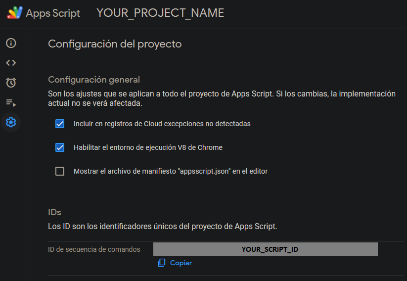

# 💻 TL; DR

1. Clone this repository using the ***"Use this template"*** button over repository files.

2. Using the new created repository URL, clone it following next steps

``` bash
git clone https://github.com/YOUR-USER-NAME/YOUR-REPOSITORY-NAME.git
cd YOUR-REPOSITORY-NAME
npm install

# In case you don't have clasp installed...
npm install -g @google/clasp
clasp login # And access to your Google account
```

3. Add your Apps Script ID inside ***.clasp.json*** file located in root in his ***scriptId*** key.



4. Push your TS project on Google Apps Script using

``` bash
npm run deploy
```

---

## 🤔 How to push HTML or non TypeScript files?

If you need to push some other files that will not be included in transpilation process, you can put them into *app/* folder *(or whatever location you want if you change ***.claspignore*** configuration)*.

Put your assets in here, meaning some HTML or any JavaScript file you need to be pushed to Google Apps Script.

---

## 🍕 Extras

Project has preloaded next libraries that will help you to have a better development experience:

- TypeScript.
- ESLint.
- Prettier.
- RollupJS.
- Babel.

In case you want ignore certain files to be pushed, you can add them to ***.claspignore*** file. You can see in it some already ignored base directories.

*P.D.: Of course you can delete this **README** file and the **docs/** folder.*

---

## 💼 Example projects

You can found here some practical example uses of this template in order to help you to understand better how to link it to a Google Apps Script project

- **[Project one](https://github.com/cristobalgvera/automatic-fup)** *(include connection to Firebase)*
- **[Project two](https://github.com/cristobalgvera/open-orders-update)**
