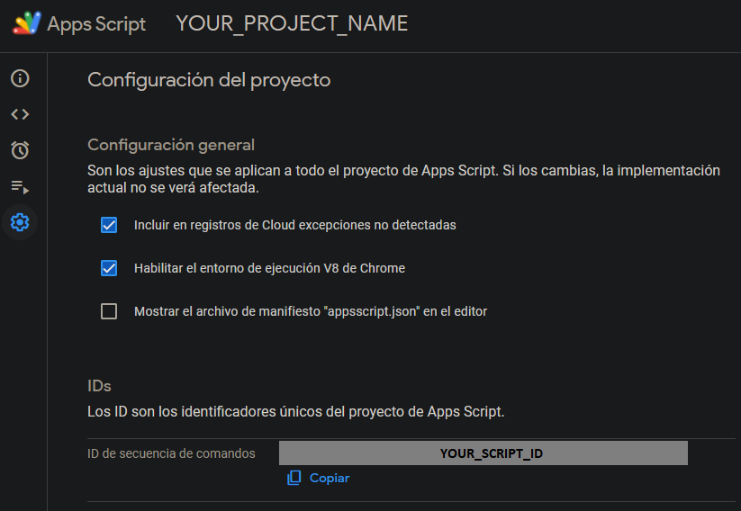

# 💻 EZ CLASP

This project works as a bootstrap to start a new [Google Apps Script](https://developers.google.com/apps-script)
project or attach it to an existing one.

It will give you, out of the box, a well defined develop flow for your GAS project.

This workflow will let you to:

- Use the latest TypeScript features.
- Use the latest EcmaScript features.
- Easily unit test your project, even if your are using the Google-related
  interfaces (SpreadsheetApp, DriveApp, DataStudioApp, etc.).
- Maintain your code always formatted and linted in your workspace.
- Manage your code using versioning tools.
- Easily make usage of environment variables.
- Treeshake your code to only deploy the one that is being used.

Welcome to your new **EZ CLASP** life 🚀

## ❓ How to

### 🥇 First usage

1. Use [this template](https://github.com/cristobalgvera/ez-clasp) by clicking
   the **_"Use this template"_** button over repository files.

   You can use `npx degit` way instead:

   ```bash
   npx degit cristobalgvera/ez-clasp YOUR_REPOSITORY_NAME
   ```

1. Using the new created repository URL, clone it following next steps

   If you used the `template` way:

   ```bash
   git clone https://github.com/YOUR_USER_NAME/YOUR_REPOSITORY_NAME.git
   cd YOUR_REPOSITORY_NAME

   npm install
   npm run clasp:login # And access to your Google account
   ```

   If you used `npx degit` way:

   ```bash
   cd YOUR_REPOSITORY_NAME

   git init
   npm install
   npm run clasp:login # And access to your Google account
   ```

1. **If you DO NOT have an existing project**, run `npm run clasp:create`
   to create a new project. CLASP CLI will prompt some project types, you
   should select one of them.

1. **If you have an existing project**, add your Apps Script ID inside
   [`.clasp.json`](./.clasp.json) in the **_scriptId_** key.

   

1. Create a `.env` file copying the [.env.example](./.env.example) file.

   ```bash
   cp .env.example .env
   ```

   Then your can make proper usage of environemnt variables in case you want.
   If you don't, simply remove all environment variable related stuff.

1. Push your project to Google Apps Script using

   ```bash
   npm run deploy
   ```

   The **first time** you execute this command, CLASP CLI will ask you to
   overwrite manifest file [`appsscript.json`](./appsscript.json), insert `y`
   key and press `enter`. This will let you to fully control your project
   from your local environment.

   The `appsscript.json` file contains configuration required by Google to
   manage permissions used by your users related to your project.

1. **Test the code opening your
   [Google Apps Script projects dashboard](https://script.google.com/home/my)!**

   There you can change your project name to the name you want (by default will
   be called `CHANGE_MY_NAME`, in order to remember you to change it).

### 🤔 How to push HTML or non TypeScript files?

If you need to push some other files that will not be included in transpilation
process, you can put them into [`app`](./app) folder _(or whatever location you
want if you change [`.claspignore`](./.claspignore) configuration)_.

You can put your assets in there, e.g. some HTML or any JavaScript file you need
to be pushed to Google Apps Script.

⚠️ **Google Apps Script only allows you to push files with these extensions:
`.html`, `.js`**. If you need files like `.css`, see Google Apps Script
[HTML best practices page](https://developers.google.com/apps-script/guides/html/best-practices).

### 🤔 How to use environment variables?

Google provide us a way to handle environment variables using the
[PropertiesService](https://developers.google.com/apps-script/reference/properties/properties-service?hl=es-419).
This way of handling environment variables can easily transform in a mess
if you are working in a developers team. You can check this way in order to
follow Google's approach.

This project gives you a way to handle environment variables directly
inside your local development using Rollup's plugins. You just need to create
a `.env` file located in the root directory of your project and then
use the secret values simply using the `process.env.YOUR_SECRET_KEY` approach.
You are free to create wrapper services to avoid repeating this pattern and
give plenty type safety to your environment variables.

In order to test the code that make usage of environment variables, you just need
to add all your required environment variables to the [env.setup.js](./test/env.setup.js)
file. This will make your entire process of testing to use those variables.

If you want to have detailed control over environment variables, you will
need to control it from your tests directly, e.g. modifying the `process.env`
object to include an specific value. Take care about how to make this
mocking process, remember the isolation of unit tests. Check
[this article](https://razinj.dev/how-to-mock-process-env-in-jest/).

### 🗂 How to add Google services, advanced Google services or external libraries?

When you add a Google service _(Gmail, Google Sheets, etc.)_ which require some
kind of permissions, e.g. permissions to read your email or write in a
spreadsheet, you will need to add those specific permissions
(a.k.a. OAuthScopes) in the file called [`appsscript.json`](./appsscript.json),
in the `oauthScope` array as a string. The list of all OAuthScopes can be
found in [here](https://developers.google.com/identity/protocols/oauth2/scopes).

Similarly, when you need to use an advanced service, like Drive
_(the old version)_, or a third party library, you will need to add those,
using the required format, in the [`appsscript.json`](./appsscript.json) file,
inside the dependencies object, in one of the arrays. See the required structure
in this [link](http://json.schemastore.org/appsscript)

#### 🧪 How to test Google libraries

Google libraries use namespaces as a resource to be imported, meaning there will
no be imported through `import` syntax. This adds a complexity when testing it.

In order to easily tests those kind of libraries, you will have to mock the global
object, like so:

```typescript
// my-class.service.ts

// In this example `GoogleService` is the service in use provided by Google
export class MyClassService {
  someMethodThatUseAnyGoogleService(body: BodyType) {
    const childGoogleService = GoogleService.anyMethod();

    return childGoogleService.childMethod(body);
  }
}
```

```typescript
// my-class.service.spec.ts

import { createMock } from '@golevelup/ts-jest';
import { MyClassService } from './my-class.service.ts';

describe('MyClassService', () => {
  let underTest: MyClassService;

  beforeEach(() => {
    underTest = new MyClassService();
  });

  describe('someMethodThatUseAnyGoogleService', () => {
    const originalService = global.GoogleService;

    let googleService: typeof GoogleService;
    let childGoogleService: ReturnType<(typeof googleService)['anyMethod']>;

    beforeEach(() => {
      childGoogleService = createMock<typeof childGoogleService>();
      googleService = createMock<typeof googleService>({
        anyMethod: () => childGoogleService,
      });

      global.GoogleService = googleService;
    });

    afterEach(() => {
      global.GoogleService = originalService;
    });

    it('should call ChildGoogleService with correct parameters', () => {
      const expected = { any: 'parameter' };

      const childGoogleServiceSpy = jest.spyOn(
        childGoogleService,
        'childMethod',
      );

      underTest.someMethodThatUseAnyGoogleService(expected as any);

      expect(childGoogleServiceSpy).toHaveBeenCalledWith(expected);
    });

    it('should return the value', () => {
      const expected = { any: 'parameter' };

      jest
        .spyOn(childGoogleService, 'childMethod')
        .mockReturnValueOnce(expected);

      const actual = underTest.someMethodThatUseAnyGoogleService({} as any);

      expect(actual).toEqual(expected);
    });
  });
});
```

## 🍕 Extras

### 📚 Libs

This project contain these libraries that will help you to have a better
development experience:

- **TypeScript** _(Development)_.
- **ESLint** + **Prettier** _(Format and linting)_.
- **Babel** + **Rollup** _(Building)_.
- **Husky** + **Lint-Staged** _(Commit)_.
- **Jest** _(Testing)_.

#### 🐾 Husky + Lint-Staged

In order to improve commitment flow when working with teams, template has a pre
configured Husky implementation. The pre-commit flow is:

- Fix **ESLint** issues if possible.
- Fix **Prettier** issues if possible.
- **Build** the code.

All tasks but build run only for the staged changes.

### ❗ Ignored files

In case you want ignore certain files to be pushed, you can add them to the
[`.claspignore`](./.claspignore) file. You can see in it some already ignored
base directories.

_P.D.: Of course you can delete this **README** file and the [`assets`](./assets)
folder._

## 💼 Example projects

You can found here some practical example usages of this template in order to
help you to understand better how to link it to a Google Apps Script project:

- **[Automatic FUP](https://github.com/cristobalgvera/automatic-fup)**
  _(include connection to Firebase)_
- **[Open Orders Update](https://github.com/cristobalgvera/open-orders-update)**
- **[CMIC Credentials](https://github.com/cristobalgvera/cmic-credentials)**
